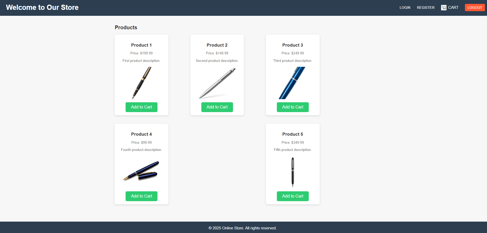
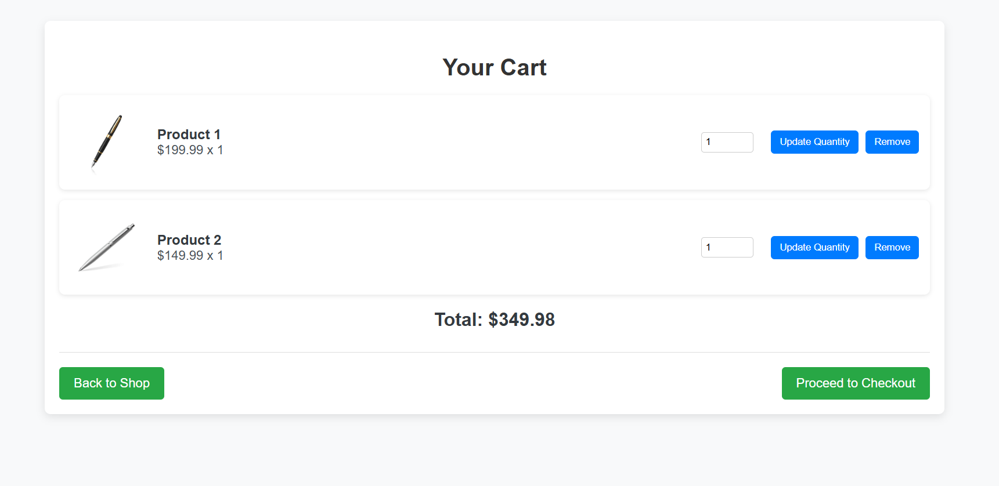
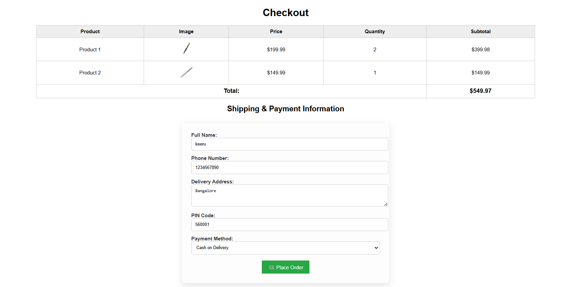
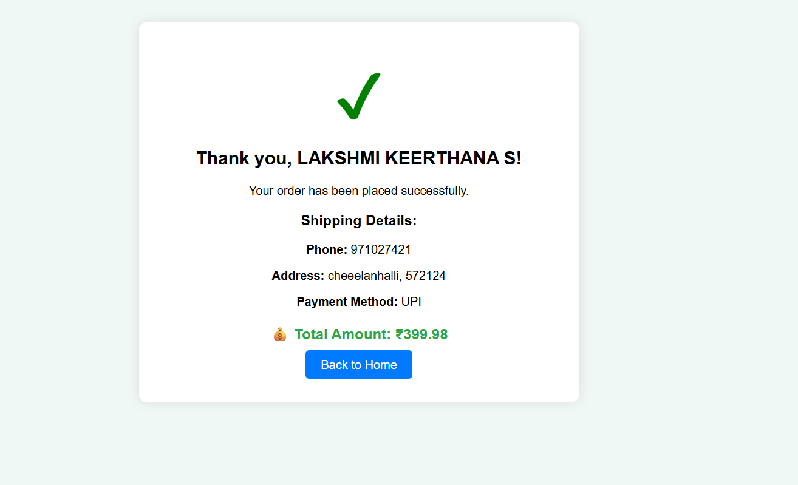

 # 🛒 Ecommerce Website using PHP & MySQL

This is a basic **Ecommerce Website** developed using **PHP**, **MySQL**, **HTML**, and **CSS**.  
It includes both **Customer** and **Admin** functionalities like product browsing, cart management, checkout, and admin product control.

---

## ✨ Features

- 👤 User Registration & Login  
- 🛍 Product Display with Images, Price & Description  
- 🛒 Add to Cart & Update Quantity  
- 💳 Checkout Page with Shipping & Payment Info  
- ✅ Order Confirmation with Summary  
- 🔐 Admin Login  
- 📦 Admin Panel to Add / Manage Products  

---

## 📁 Folder Structure
/admin → Admin login, dashboard, add/manage products
/css → Styling files
/images → Product images, cart icons, screenshots
/includes/db.php → Database connection file
/pages → Cart, login, register, checkout, confirm_order
index.php → Homepage
/database/ecommerce.sql → Database export file (import this into phpMyAdmin)

---

## ⚙️ Technologies Used

- **PHP** (Core Logic)  
- **MySQL** (Database - phpMyAdmin)  
- **HTML5** & **CSS3**  
- **XAMPP** (Apache + MySQL local server)  

---

## 💻 How to Run Locally

1. ✅ Download & Install **XAMPP**  
2. ✅ Clone this repo or **download ZIP** and place it in the `htdocs` folder  
3. ✅ Open **phpMyAdmin** and create a database named `ecommerce`  
4. ✅ Import the provided `ecommerce.sql` file into the database  
5. ✅ Start **Apache** and **MySQL** in XAMPP  
6. ✅ Visit in browser:
7. http://localhost/Ecommerce-website/

---

## 📸 Screenshots

### 🏠 Homepage  

### 🛒 Cart  

### 💳 Checkout  

### ✅ Order Confirmation  

---

## 📄 License

This project is for **educational and demonstration purposes** only.  
Feel free to fork, use and learn from it.

---

> Created with ❤️ by **Lakshmi Keerthana S**

